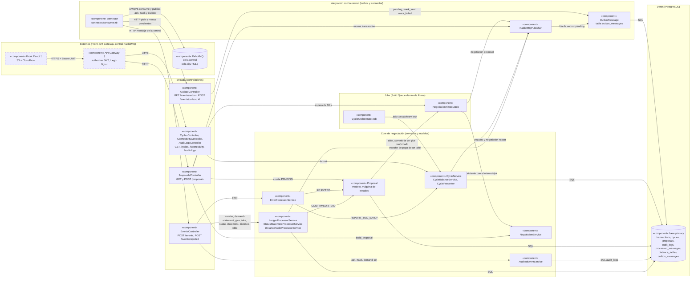

# Diagrama UML

Vista UML de componentes de lo que corre dentro del contenedor `web` (Rails) y de cómo se conecta con el
connector y la central. Cada flecha va **desde quien inicia** hacia quien recibe, y su etiqueta dice qué viaja.
Todo sale de `config/routes.rb`, `app/controllers`, `app/services`, `app/jobs`, `app/models` y `connector/`. Lo
marcado con † (y borde punteado) no se ve en el repo y se toma **según la documentación de despliegue**
(`docs/arquitectura-y-despliegue.md`).

## Explicación del diagrama

- **Capas.** Los controladores reciben HTTP del front (vía API Gateway † y Nginx) o del connector (por la red
  interna de Docker). El core aplica las reglas del protocolo y guarda en la base `primary`. Los jobs corren en
  Solid Queue dentro del mismo proceso Puma, con sus colas en la base `queue`. El outbox y el connector son el único
  camino hacia la central: el back nunca abre una conexión al broker.
- **Evento entrante.** El connector consume `city.TK3.q`, valida el mensaje y hace `POST /events`.
  `EventsController` elige el procesador según `type` (`EventsController::PROCESSORS`). Si el procesador responde
  2xx, el connector publica el `ack` directo a la central (no por el outbox). Un `idpk` repetido responde
  `200 duplicate` y no toca el ledger (`transactions.idpk` y `processed_messages.idpk` son únicos).
- **Confirmación de una propuesta.** Un `give` de la central pasa la propuesta a CONFIRMED y su transfer a PAID. Un
  `take` la pasa a PAID y deja en el outbox nuestro `transfer` de pago. Un `error` (PRICE_ABOVE_CAP, OVER_CAPACITY,
  CYCLE_EXPIRED, CYCLE_UNKNOWN) la cierra como REJECTED.
- **Propuesta saliente.** `ProposalsController` valida con `NegotiationService` (precio y capacidad vendible),
  crea la `Proposal` PENDING y la fila de outbox en una sola transacción, y agenda `NegotiationTimeoutJob` a 30 s.
  El connector pide los pendientes cada 2 s (`GET /events/outbox`), los publica con `user_id` esperando el confirm
  del broker, y los marca con `POST /events/outbox/:id`.
- **Esperas de 30 s.** Una propuesta sin confirmación se reintenta con el mismo `idpk` y `msgId` nuevo hasta que
  cierra la ventana del ciclo (pasa a EXPIRED). Un `give` confirmado sin transfer se reintenta hasta 3 veces (luego
  FAILED).
- **Ciclo autónomo.** El initializer `start_orchestrator` encola `CycleOrchestratorJob`, que se reprograma solo
  y llama a `CycleService.tick`: pide el `status-statement` si no llega y encola el `negotiation-report` en el
  periodo de cierre, con los saldos que calcula `CycleBalanceService`.
- **Lectura del front.** `CyclesController` arma cada ciclo con `CyclePresenter`. `ConnectivityController` y
  `AuditLogsController` leen directo `distance_tables` y `audit_logs`.
