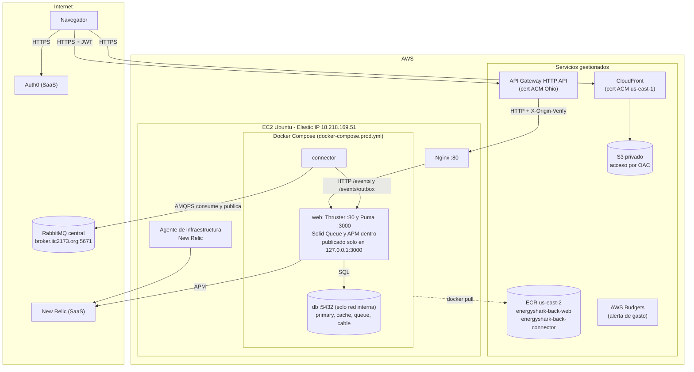
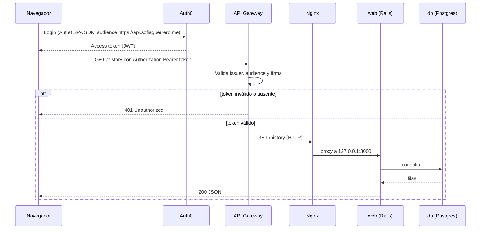

# Arquitectura y despliegue (EnergyShark E1, ciudad TK3)

Este documento describe cómo está desplegado el sistema en AWS, qué hace cada componente y por qué
se tomaron las decisiones principales. Los diagramas están en Mermaid: GitHub los dibuja
automáticamente al abrir este archivo. Los dos diagramas UML de componentes (sistema completo y
componentes internos del back) están en [`docs/diagramas/`](diagramas/); la sección 9 explica cómo leerlos.

Lo marcado con † está configurado fuera del repo (consola de AWS, Auth0 o la propia EC2) y no se puede
verificar desde el código.

## 1. Vista general

| Componente | Qué es | Dónde corre |
|---|---|---|
| Frontend | SPA React + Vite + TypeScript | S3 (bucket privado) servido por CloudFront en `https://app.sofiaguerrero.me` † |
| Autenticación | Auth0 (access token JWT) | SaaS de Auth0 † |
| API pública | API Gateway (HTTP API) con authorizer JWT, CORS y una ruta `OPTIONS` sin authorizer | AWS, región Ohio (`us-east-2`), en `https://api.sofiaguerrero.me` † |
| Reverse proxy | Nginx: exige el header `X-Origin-Verify` † y responde 404 en `/events` (`infra/nginx/api.conf`) | EC2 Ubuntu, puerto 80 |
| Backend | Rails 8 en modo API: Thruster (puerto 80 del contenedor) delante de Puma (3000). Solid Queue corre dentro de Puma (`SOLID_QUEUE_IN_PUMA=true`) y ejecuta `CycleOrchestratorJob` y `NegotiationTimeoutJob` | Contenedor `web`, imagen `energyshark-back-web` de ECR |
| Base de datos | PostgreSQL 15 con cuatro bases lógicas: `primary`, `cache`, `queue` y `cable` | Contenedor `db` (`postgres:15-alpine`), sin puerto publicado |
| Connector | Programa Ruby (gema `bunny`). Consume `city.TK3.q`, entrega cada mensaje a `POST /events`, responde `ack`/`nack` a la central y publica los mensajes que el back deja en el outbox (`GET /events/outbox`). Solo publica si `ENABLE_PUBLISHER=true` | Contenedor `connector`, imagen `energyshark-back-connector` de ECR |
| Broker | RabbitMQ de la central (`broker.iic2173.org:5671` †, AMQPS) | Externo (del curso) |
| Registro de imágenes | Amazon ECR | AWS, región Ohio (`us-east-2`) |
| Monitoreo | New Relic: agente de infraestructura en la EC2 † y APM en el backend (gema `newrelic_rpm`) | SaaS de New Relic |
| Costos | AWS Budgets con alerta † | AWS (global) |

## 2. Diagrama de componentes

El diagrama UML de componentes, con su explicación debajo, está en
[`docs/diagramas/componentes.md`](diagramas/componentes.md). Lo que hay dentro del contenedor `web` (controladores,
servicios, jobs y outbox) está en [`docs/diagramas/componentes-internos-back.md`](diagramas/componentes-internos-back.md).
En resumen:

- **Front.** El navegador descarga la SPA desde CloudFront (que lee el bucket S3 privado con OAC †), inicia
  sesión en Auth0 † y llama a la API por HTTPS con el access token como `Bearer`.
- **Entrada a la API.** API Gateway † valida el JWT contra las claves públicas de Auth0 y reenvía por HTTP a
  Nginx en la EC2 agregando `X-Origin-Verify` †. Nginx pasa a `127.0.0.1:3000`, que es Thruster dentro del
  contenedor `web`, y Thruster a Puma.
- **Back.** Rails atiende al front (`/cycles`, `/connectivity`, `/proposals`, `/audit-logs`) y al connector
  (`/events`, `/events/rejected`, `/events/outbox`). Solid Queue, dentro del mismo proceso Puma, corre el
  orquestador del ciclo y las esperas de 30 s de las propuestas. Todo se guarda en el Postgres del contenedor `db`.
- **Mensajería.** El back **no se conecta al broker**: deja los mensajes de salida en la tabla `outbox_messages`.
  El connector es el único que habla AMQPS con la central: consume `city.TK3.q`, publica los `ack`/`nack` de lo
  que recibe y, cada 2 s, publica lo pendiente del outbox (`negotiation-proposal`, `transfer` de pago,
  `negotiation-report` y `request`).
- **Imágenes y monitoreo.** `web` y `connector` se descargan de ECR. El agente APM reporta desde `web` y el
  agente de infraestructura † desde la EC2, ambos a New Relic.

## 3. Diagrama de despliegue

CloudFront, S3, API Gateway, los certificados ACM, AWS Budgets, el Elastic IP y el agente de infraestructura
se configuraron fuera del repo †. Lo que sí está en el repo: `docker-compose.prod.yml` (contenedores, imágenes de
ECR, puertos y `SOLID_QUEUE_IN_PUMA`), `infra/nginx/api.conf` y los `Dockerfile` de `web` y `connector`.

## 4. Flujo de una petición autenticada

## 5. Flujo de mensajes con la central

Los componentes que intervienen están en
[`componentes-internos-back.md`](diagramas/componentes-internos-back.md).

**Entrada (de la central hacia nosotros)**

1. La central publica sus mensajes (`status-statement`, `transfer`, `demand-statement`, `distance-table`, `give`,
   `take`, y sus respuestas `ack`, `nack` y `error`) hacia nuestra cola `city.TK3.q`, en el exchange `energy.x` †.
2. El `connector` se conecta por AMQPS con el usuario `city.TK3`, abre la cola en modo `passive`, y la consume con
   ack manual y `prefetch(1)`: un mensaje a la vez.
3. Valida el mensaje. Si no es JSON o no trae `msgId`, lo descarta. Si el envelope o el contenido es inválido, el
   `idpk` es igual al `msgId` o el tipo no existe, responde un `nack` a la central. En ambos casos lo registra en
   `POST /events/rejected` (tabla `audit_logs`) y lo saca de la cola.
4. Si es válido hace `POST /events` por la red interna de Docker y actúa según la respuesta:
   - **2xx** (`201 saved` o `200 duplicate`): publica `ack` a la central y lo saca de la cola. Un duplicado no
     vuelve a tocar el ledger.
   - **422**: publica un `nack` `MALFORMED_MESSAGE` o `UNKNOWN_TYPE` y lo saca de la cola.
   - **500** (u otro error que no sea 422, 502, 503 ni 504): lo devuelve a la cola esperando 5, 15 y 45 s. Al
     cuarto fallo lo descarta (lo registra como `MAX_RETRIES_EXCEEDED`), sin `nack` a la central.
   - **502, 503, 504 o sin respuesta**: la API está caída. Espera 5 s y lo devuelve a la cola, sin límite, sin
     `ack` y sin descartarlo.
5. Las respuestas de la central (`ack`, `nack`, `error`) se guardan en `audit_logs` y nunca se responden. Un
   `error` sobre una propuesta la cierra como `rejected`; un `REPORT_TOO_EARLY` reprograma el reporte.

**Salida (de nosotros hacia la central)**

6. El back no se conecta al broker. Cuando necesita enviar algo (`negotiation-proposal`, el `transfer` que paga un
   `take`, el `negotiation-report` o un `request`), `RabbitMQPublisher` lo guarda en `outbox_messages` como
   `pending`, en la misma transacción que el cambio que lo origina.
7. Un hilo del connector pide cada 2 s `GET /events/outbox`, publica cada mensaje en el exchange con la propiedad
   AMQP `user_id`, espera la confirmación del broker y lo marca con `POST /events/outbox/:id` (`sent` o `failed`).
   Si el broker no confirma, el mensaje queda pendiente para la vuelta siguiente.
8. Los `ack` y `nack` del paso 3 y 4 no pasan por el outbox: el connector los publica directo.
9. Todo lo que publica el connector depende de `ENABLE_PUBLISHER`: solo con `true` sale hacia la central. Con
   otro valor sigue consumiendo y guardando, pero solo loguea lo que publicaría y el outbox queda pendiente.

**Ciclo autónomo (orquestador)**

10. `CycleOrchestratorJob` corre en Solid Queue y se reprograma solo (cada 30 s a 1 min), tomando un advisory lock
    de Postgres para que nunca corran dos revisiones a la vez. Todo se mide relativo a `T`, el `validUntil` del
    `status-statement`: la ventana abre en `T - 20 min` y el periodo de cierre va de `T - 5 min` a `T`.
11. Si el `status-statement` no llega 1 min después de la apertura esperada, lo pide con un `request` (máximo 3
    por ventana). Si no hay ninguna `distance-table` guardada, también la pide.
12. En el periodo de cierre encola el `negotiation-report` con los saldos del ledger. Si los saldos cambian lo
    corrige con un `idpk` nuevo; no encola nada después de `T - 30 s`, y el outbox no publica un reporte a menos de
    5 s de `T`. Un `REPORT_TOO_EARLY` lo reprograma para `data.opensAt` con el mismo `idpk`. Si la ventana cierra
    sin reporte entregado, queda registrado como `REPORT_MISSED` en `audit_logs`.

**Negociación voluntaria (propuesta saliente)**

13. `POST /proposals` valida precio y capacidad vendible con `NegotiationService` y crea la `Proposal` en estado
    `pending` junto con su fila de outbox, en una sola transacción. El connector la publica como cualquier otro
    mensaje del outbox.
14. La central confirma con `give` (la propuesta pasa a `confirmed` y luego a `paid` cuando llega su `transfer`) o
    con `take` (pasa a `paid` y el back deja en el outbox el `transfer` con que pagamos). Un `error`
    `PRICE_ABOVE_CAP`, `OVER_CAPACITY`, `CYCLE_EXPIRED` o `CYCLE_UNKNOWN` la cierra como `rejected`.
15. `NegotiationTimeoutJob` espera 30 s. Sin confirmación, reintenta con el mismo `idpk` y `msgId` nuevo hasta que
    cierra la ventana (`expired`). Si un `give` confirmado no recibe su transfer, reintenta hasta 3 veces
    (`failed`).

**Exposición:** Nginx responde 404 en la ruta exacta `/events` y API Gateway exige token en todas las rutas salvo
`/up`, `/healthz` y los `OPTIONS` del preflight †. Las otras rutas internas (`/events/rejected`, `/events/outbox` y
`/events/outbox/:id`) no están bloqueadas en Nginx (ver sección 7).

## 6. Decisiones de diseño

| Decisión | Motivo |
|---|---|
| **HTTP API de API Gateway** con authorizer JWT nativo, en vez de REST API con authorizer propio | Valida directamente los tokens de Auth0 con issuer y audience, sin escribir código de autorización. Más simple y más barato. |
| **Auth0** como proveedor de identidad | Recomendado por el enunciado. El token es un JWT firmado (RS256) que API Gateway valida con las claves públicas del emisor. |
| **S3 privado + CloudFront con OAC** | El bucket no es público: solo CloudFront puede leerlo, y todo el tráfico del front va por HTTPS. |
| **Reglas 403 y 404 hacia `/index.html` (código 200)** en CloudFront | El front usa rutas del navegador (React Router). Sin esto, recargar en `/cycles` daría error. |
| **Dos certificados ACM** | El de `api` en Ohio (API Gateway regional) y el de `app` en us-east-1 (obligatorio para CloudFront). |
| **Nginx delante de Rails** y `/events` bloqueado hacia afuera | Evita que alguien con un token pueda inyectar eventos. Solo el connector, por la red interna, puede llamarlo. El bloqueo es solo para la ruta exacta `/events` (`location = /events` en `infra/nginx/api.conf`); `/events/rejected` y `/events/outbox*` no están bloqueadas. |
| **Header secreto `X-Origin-Verify`** de API Gateway a Nginx | Impide saltarse el authorizer llamando directo a la IP de la EC2: sin el header, Nginx responde 403. |
| **Postgres sin puerto publicado** | Solo los contenedores del mismo Compose pueden acceder. El Security Group solo abre 22, 80 y 443. |
| **Secretos solo en el `.env` del servidor** | El repo solo contiene `.env.example` con valores falsos. |

## 7. Estado y limitaciones conocidas

- **Tramo API Gateway a EC2 por HTTP.** El HTTPS hacia los usuarios lo termina API Gateway. El
  tramo hacia la EC2 viaja por HTTP dentro de AWS, protegido con el header secreto
  `X-Origin-Verify` (ver más abajo). Mejora posible: certificado en Nginx e integración HTTPS.
- **`ENABLE_PUBLISHER`.** En `docker-compose.prod.yml` su valor por defecto es `false`: si la variable falta en el
  `.env`, el connector consume y guarda pero no publica nada (ni `ack`/`nack` ni el outbox). En producción está
  en `true`.
- **Solid Queue depende de `SOLID_QUEUE_IN_PUMA`.** No hay un contenedor aparte para los jobs. Sin esa variable los
  jobs se encolan pero nadie los ejecuta: se detienen el orquestador del ciclo y las esperas de las propuestas.
- **Una sola instancia EC2** de 1 GB de RAM con swap de 2 GB †. No hay alta disponibilidad: si la
  instancia cae, el servicio se interrumpe hasta que se reinicie.
- **El backend no valida JWT.** Confía en que API Gateway sea la única entrada: la autenticación
  se hace solo en el authorizer. Como Nginx también escucha en el puerto 80 de la IP pública,
  una petición directa a la IP evitaría el authorizer. Mitigación aplicada: API Gateway agrega
  el header `X-Origin-Verify` (valor secreto) a cada petición hacia la EC2, y Nginx responde 403
  a las que no lo traen. El valor real vive solo en el servidor
  (`/etc/nginx/snippets/origin-verify.conf`) y en la configuración de las integraciones de API
  Gateway; no está en el repo. El backend sigue sin validar el JWT por sí mismo.
- **Rutas internas sin bloquear en Nginx.** `/events/rejected`, `/events/outbox` y `/events/outbox/:id` son para el
  connector, pero Nginx solo bloquea `/events`. Con un token válido, y si API Gateway las enruta, podrían llamarse
  desde afuera.
- **CORS.** El navegador solo ve la configuración de CORS de API Gateway (orígenes
  `https://app.sofiaguerrero.me` y `http://localhost:5173`, cada uno como entrada separada;
  headers `authorization` y `content-type`; métodos `GET`, `POST` y `OPTIONS`) †. Como el front
  envía `Authorization`, el navegador hace una petición preflight `OPTIONS` sin token, así que
  existe una ruta `OPTIONS /{proxy+}` **sin authorizer**; sin ella el authorizer respondería 401
  al preflight. La configuración de `rack-cors` del backend (`config/initializers/cors.rb`) tiene orígenes fijos en
  el código, es más amplia y no se usa para el front desplegado; no lee `CORS_ORIGINS`.
- **Reintentos de propuestas.** Una propuesta sin confirmación se reintenta cada 30 s con el mismo `idpk` hasta
  que cierra la ventana del ciclo (pasa a `expired`). Un `give` confirmado sin transfer se reintenta hasta 3 veces
  (luego `failed`). El estado `timeout` existe en el enum de `Proposal` pero nunca se asigna.
- **Tabla `demand_events` y `/history`.** Son de la E0: `/history` sigue respondiendo, pero ningún componente
  escribe ya en `demand_events` y el front no la usa.
- **Registro de NACK.** El `nack` que el connector publica cuando el back responde 422 no queda en `audit_logs`;
  los que decide el propio connector sí.
- **Dependencia externa del front.** El navegador también carga las tipografías de Google Fonts.
- **Cuatro bases lógicas en un mismo Postgres** (`primary`, `cache`, `queue` y `cable`), creadas
  por `db:prepare` al arrancar el contenedor `web` (`bin/docker-entrypoint`).

## 8. Variables de entorno relevantes

El detalle y los valores de ejemplo están en `.env.example`. Los valores reales viven solo en el
`.env` del servidor. El mismo `.env` lo leen los tres contenedores (`env_file: .env` en `docker-compose.prod.yml`).

| Variable | Quién la usa | Para qué sirve |
|---|---|---|
| `RAILS_MASTER_KEY` | web | Descifra las credenciales de Rails |
| `ALLOWED_HOSTS` | web | Hosts públicos permitidos por Rails (protección contra Host header) |
| `POSTGRES_USER`, `POSTGRES_PASSWORD`, `POSTGRES_DB` | db | Usuario, clave y base inicial del contenedor Postgres |
| `DATABASE_URL`, `CACHE_DATABASE_URL`, `QUEUE_DATABASE_URL`, `CABLE_DATABASE_URL`, `E0_DATABASE_PASSWORD` | web | Conexión a las cuatro bases (principal, cache, queue, cable) |
| `SOLID_QUEUE_IN_PUMA` | web | Corre Solid Queue dentro de Puma. `docker-compose.prod.yml` la fija en `true` |
| `CITY_ID` | web y connector | `cityId` de los mensajes que enviamos (`TK3`) y respuesta de `/connectivity` |
| `RABBITMQ_URL`, `RABBITMQ_USER` | connector | Conexión al broker. `RABBITMQ_USER` (`city.TK3`) va como propiedad AMQP `user_id` al publicar |
| `QUEUE_NAME` | connector | Cola que se consume (`city.TK3.q`) |
| `RABBITMQ_EXCHANGE`, `CENTRAL_ROUTING_KEY` | connector | Exchange y routing key con que se publica hacia la central |
| `MASTER_URL` | connector | URL de `POST /events` en el contenedor `web`; de ella salen `/events/rejected` y `/events/outbox` |
| `ENABLE_PUBLISHER` | connector | Solo con `true` el connector publica hacia la central |
| `NEW_RELIC_LICENSE_KEY`, `NEW_RELIC_APP_NAME`, `NEW_RELIC_LOG` | web | Configuración del agente APM (`newrelic_rpm`) |
| `ECR_REGISTRY` | docker compose | Registro de ECR de las imágenes (tiene un valor por defecto en el compose) |
| `CYCLE_LENGTH_MINUTES`, `NEGOTIATION_WINDOW_MINUTES`, `REPORT_PERIOD_MINUTES` | web | Opcionales: duración del ciclo, de la ventana y del periodo de cierre (por defecto 120, 20 y 5) |

`.env.example` también define `CITY_ROUTING_KEY`, `CITY_NAME`, `CORS_ORIGINS` y `OBSERVER_ID`, pero el código
actual no las lee.

## 9. Cómo leer los diagramas

Hay dos diagramas UML de componentes, ambos en [`docs/diagramas/`](diagramas/), con el mismo estilo: cada flecha va
desde quien inicia hacia quien recibe, y su etiqueta dice qué viaja. Cada uno tiene la explicación debajo y termina
con una lista "A confirmar". Lo marcado con † viene de esta documentación de despliegue y no se ve en el repo.

- [`componentes.md`](diagramas/componentes.md): el sistema completo (front, Auth0, API Gateway, Nginx, contenedores
  `web`, `db` y `connector`, la central, New Relic y ECR), con el protocolo de cada conexión (HTTPS, HTTP, AMQPS,
  SQL). Muestra el connector consumiendo y publicando, el outbox, Solid Queue dentro de Puma y ECR.
- [`componentes-internos-back.md`](diagramas/componentes-internos-back.md): lo que hay dentro del back, por capas
  (controladores, core de negociación, jobs, integración con la central y datos). Sirve para seguir el camino de un
  evento entrante (connector → `EventsController` → procesador → base) y de una propuesta saliente
  (`ProposalsController` → `RabbitMQPublisher` → `outbox_messages` → connector → central).
