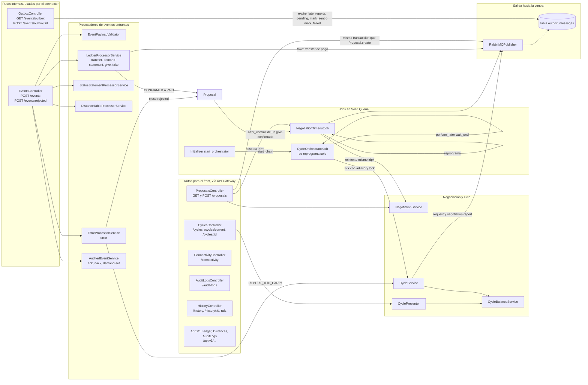

# Componentes internos del back (Rails)

Qué hay dentro del contenedor `web` y quién llama a quién. Las flechas van del que llama al llamado.
Todo sale de `config/routes.rb`, `app/controllers`, `app/services`, `app/jobs`, `app/models` y
`config/initializers/start_orchestrator.rb`. Los modelos (ActiveRecord) se muestran en la tabla de abajo para no
cruzar el diagrama de flechas: cada fila dice qué componente lee o escribe cada tabla.

## Tablas que usa cada componente

| Componente | Lee | Escribe |
|---|---|---|
| `EventsController#rejected` | — | `audit_logs` (NACK, CENTRAL_*, DISCARDED) |
| `LedgerProcessorService` | `outbox_messages`, `proposals`, `transactions` | `transactions`, `proposals.status`, `audit_logs` (DUPLICATE), `outbox_messages` (vía `RabbitMQPublisher`) |
| `StatusStatementProcessorService` | — | `processed_messages`, `cycles` |
| `DistanceTableProcessorService` | — | `processed_messages`, `distance_tables` |
| `ErrorProcessorService` | `outbox_messages`, `proposals`, `cycles` | `processed_messages`, `audit_logs` (CENTRAL_ERROR), `proposals`, `outbox_messages` (anula reintentos), `cycles.report_not_before` |
| `AuditedEventService` | — | `processed_messages`, `audit_logs` (CENTRAL_ACK, CENTRAL_NACK, DEMAND_SET) |
| `ProposalsController` | `cycles`, `proposals` | `proposals`, `outbox_messages` |
| `NegotiationService` | `cycles`, `transactions`, `outbox_messages` | — |
| `NegotiationTimeoutJob` | `proposals`, `cycles`, `transactions`, `outbox_messages` | `proposals`, `outbox_messages` |
| `CycleService` | `cycles`, `outbox_messages`, `distance_tables` | `cycles`, `outbox_messages`, `audit_logs` (REPORT_MISSED) |
| `CycleBalanceService` | `cycles`, `transactions` | — |
| `CyclePresenter` | `transactions`, `proposals`, `outbox_messages` | — |
| `OutboxController` | `outbox_messages`, `cycles` | `outbox_messages` |
| `ConnectivityController` | `distance_tables`, `processed_messages` | — |
| `AuditLogsController` | `audit_logs`, `transactions` | — |
| `HistoryController` | `demand_events` | — |
| `Api::V1::*` | `transactions`, `distance_tables`, `audit_logs` | — |

## Notas de lectura

- `EventsController::PROCESSORS` (`app/controllers/events_controller.rb:24-32`) decide el procesador según `type`.
  `error` va a `ErrorProcessorService`; `ack`, `nack` y `demand-set` a `AuditedEventService`.
- `ProcessedMessage.process_once` (`app/models/processed_message.rb:6-20`) es la barrera de idempotencia de los
  mensajes que no dejan fila propia con `idpk`. Si el `idpk` ya existe, deja un `AuditLog` DUPLICATE y el
  controller responde `200 duplicate`.
- `CycleOrchestratorJob` lo encola el initializer solo cuando corre `rails server` (`config/initializers/start_orchestrator.rb`).
  Cada ejecución toma `pg_advisory_xact_lock` y se reprograma aunque falle (`app/jobs/cycle_orchestrator_job.rb:33-43`).
- `Proposal` agenda la espera del transfer en un `after_commit` (`app/models/proposal.rb:27`, `74-77`), no desde
  `LedgerProcessorService`.
- `AuditedEventService` tiene una rama para `error` con `REPORT_TOO_EARLY` (`app/services/audited_event_service.rb:24-26`)
  que no se ejecuta: `error` siempre va a `ErrorProcessorService`.

## A confirmar

- `HistoryController` y la tabla `demand_events` son de la E0: ningún componente actual escribe en `demand_events`
  y el front no llama a `/history`. Confirmar si se mantienen o se retiran.
- Las rutas `/api/v1/...` no las usa el front (usa `/cycles`, `/connectivity`, `/proposals` y `/audit-logs`).
  Confirmar si se mantienen.
