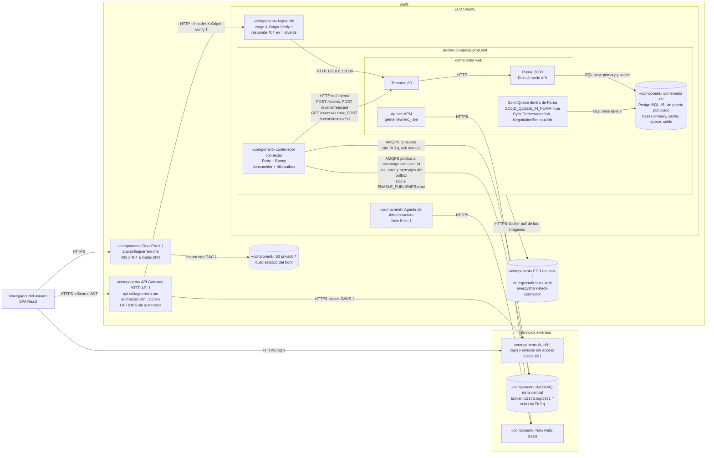

# Diagrama de componentes (arquitectura actual)

Vista UML de componentes del nodo EnergyShark de la ciudad TK3 tal como corre hoy en producción.
Cada flecha va **desde quien inicia la conexión** hacia quien la recibe, y su etiqueta indica el protocolo.
Los contenedores `web`, `connector` y `db` y sus conexiones salen de `docker-compose.prod.yml`, `Dockerfile`,
`config/puma.rb`, `infra/nginx/api.conf` y del código del connector. Lo marcado con † (y borde punteado)
no se ve en el repo y se toma **según la documentación de despliegue** (`docs/arquitectura-y-despliegue.md`).

## Notas de lectura

- **El back nunca habla con el broker.** `RabbitMQPublisher` (`app/services/rabbit_m_q_publisher.rb`) solo
  inserta una fila en `outbox_messages`. El hilo outbox del connector la pide cada 2 s con `GET /events/outbox`,
  la publica esperando el *publisher confirm* del broker y la marca con `POST /events/outbox/:id`
  (`connector/lib/outbox_sender.rb`). Por el outbox salen `negotiation-proposal`, `transfer` (pago de un `take`),
  `negotiation-report` y `request`.
- **Los `ack` y `nack` de los mensajes recibidos no pasan por el outbox:** el connector los publica directo en el
  canal de consumo (`connector/lib/central_publisher.rb`). El connector no publica mensajes `error`, `give` ni
  `take`: esos los emite la central.
- **`ENABLE_PUBLISHER`** (`connector/consumer.rb:16`): solo con el valor exacto `true` el connector publica. En
  `docker-compose.prod.yml` el valor por defecto es `false` si falta en el `.env`. Apagado, el connector sigue
  consumiendo y guardando, pero solo loguea lo que publicaría y deja el outbox pendiente.
- **Solid Queue** corre como plugin de Puma (`config/puma.rb:38`) y guarda sus jobs en la base lógica `queue`
  (`config/environments/production.rb:50-51`). Las cuatro bases lógicas (`config/database.yml`, sección
  `production`) viven en el mismo servidor Postgres del contenedor `db`.
- **New Relic:** el agente APM es la gema `newrelic_rpm` (`Gemfile`), configurada con las variables `NEW_RELIC_*`.
  El agente de infraestructura está instalado en la EC2 (†).
- **ECR:** `web` y `connector` usan imágenes de ECR en `us-east-2` (`docker-compose.prod.yml`); `db` usa
  `postgres:15-alpine` de Docker Hub.

## A confirmar

- Valor real de `MASTER_URL` en producción (vive en el `.env`, que no se leyó). La documentación de despliegue dice
  `http://web/events`, que apunta a Thruster en el puerto 80 del contenedor `web`.
- Quién construye y sube las imágenes a ECR y con qué comando: el repo no tiene CI (no hay `.github/`).
- Que las variables `NEW_RELIC_*` estén definidas en el `.env` de producción (de eso depende que el APM reporte).
- Protocolo y región del endpoint de New Relic (se asume HTTPS, que es como reportan sus agentes; el repo no lo
  fija).
- Si API Gateway enruta o bloquea `/events/rejected`, `/events/outbox` y `/events/outbox/:id`: Nginx solo bloquea
  la ruta exacta `/events` (`infra/nginx/api.conf:6`).
- Nombre del exchange: el código lo lee de `RABBITMQ_EXCHANGE`; la documentación de despliegue lo nombra `energy.x`.
