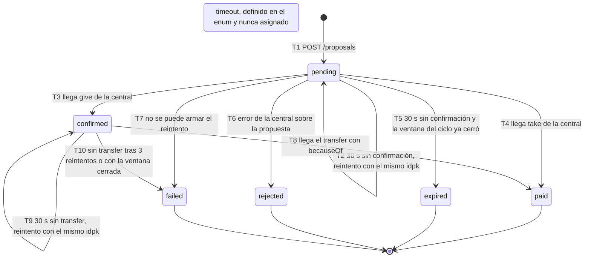
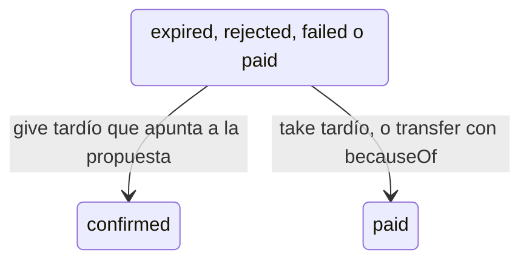

# Diagrama de estados de `Proposal`

Estados del enum `status` de `Proposal` (`app/models/proposal.rb:14-22`): `pending`, `confirmed`, `paid`,
`timeout`, `expired`, `rejected` y `failed`, guardados en la columna `proposals.status` en mayúsculas.
Cada transición del diagrama lleva un código (T1, T2, ...) que se explica en la tabla con el evento que la provoca
y el `archivo:línea` donde ocurre. `timeout` existe en el enum pero ningún código lo asigna: una propuesta que
vence sin confirmación pasa a `expired`.

| Código | De → a | Evento | Dónde |
|---|---|---|---|
| T1 | inicio → `pending` | `POST /proposals` válido crea la propuesta junto con su mensaje en el outbox | `app/controllers/proposals_controller.rb:38-46` (estado por defecto en `app/models/proposal.rb:22`) |
| T2 | `pending` → `pending` | `NegotiationTimeoutJob` a los 30 s: sigue pendiente y la ventana está abierta, se publica de nuevo con el mismo `idpk` y `msgId` nuevo | `app/jobs/negotiation_timeout_job.rb:37-40` |
| T3 | `pending` → `confirmed` | Mensaje `give` de la central (`data.target` = `msgId` de la propuesta). Se registra `confirmed_at` y se agenda la espera del transfer | `app/services/ledger_processor_service.rb:80`; `app/models/proposal.rb:26-27` |
| T4 | `pending` → `paid` | Mensaje `take` de la central; en la misma transacción se encola nuestro `transfer` de pago | `app/services/ledger_processor_service.rb:88`, `104` |
| T5 | `pending` → `expired` | `NegotiationTimeoutJob`: `now >= cycles.valid_until` (o el ciclo no existe) | `app/jobs/negotiation_timeout_job.rb:28-29`, `110-114` |
| T6 | `pending` → `rejected` | `error` con `PRICE_ABOVE_CAP`, `OVER_CAPACITY`, `CYCLE_EXPIRED` o `CYCLE_UNKNOWN` cuyo `data.target` es un mensaje de la propuesta | `app/services/error_processor_service.rb:6`, `23-24`, `42`; `app/models/proposal.rb:36-44` |
| T7 | `pending` → `failed` | Al armar el reintento salta `RecordNotFound`, `OverCapacityError` o `PriceCapExceededError` | `app/jobs/negotiation_timeout_job.rb:41-43` |
| T8 | `confirmed` → `paid` | `transfer` con `data.becauseOf` = `msgId` del `give`; o el job de espera encuentra ese transfer en el ledger | `app/services/ledger_processor_service.rb:116`; `app/jobs/negotiation_timeout_job.rb:61-63` |
| T9 | `confirmed` → `confirmed` | Espera del transfer vencida, ventana abierta y menos de 3 reintentos: se publica de nuevo y sube `transfer_retries` | `app/jobs/negotiation_timeout_job.rb:80-83` |
| T10 | `confirmed` → `failed` | Ventana cerrada sin transfer, 3 reintentos agotados, o el reintento no se puede armar | `app/jobs/negotiation_timeout_job.rb:69-77`, `90-93`, `96-99` |

## Transiciones sin guardia de estado

`LedgerProcessorService` pasa la propuesta a `confirmed` o `paid` con `update!` sin revisar el estado actual
(`app/services/ledger_processor_service.rb:80`, `88`, `116`). Por eso un `give`, `take` o `transfer` que llegue
tarde y apunte a la propuesta por `data.target` la cambia aunque ya esté cerrada:

En cambio, los cierres de T5, T6, T7 y T10 usan `Proposal#close!`, que toma un lock y solo cambia el estado si la
propuesta está en el estado esperado (`app/models/proposal.rb:36-44`).

## A confirmar

- Si `timeout` debe quedarse en el enum (no se usa) o eliminarse.
- Si es intencional que un `give`/`take`/`transfer` tardío reabra una propuesta cerrada.
