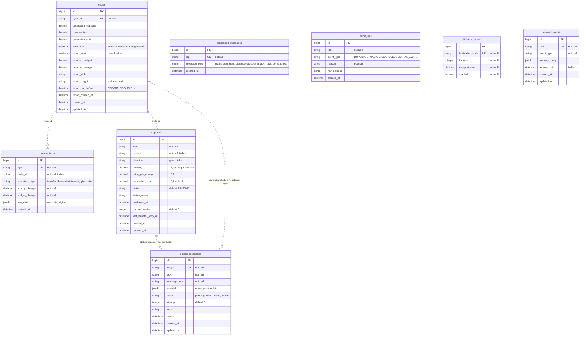

# Modelo de datos (base `primary`)

Entidad-relación de las tablas de `db/schema.rb` (versión `2026_10_08_200000`). El esquema **no declara claves
foráneas**: las relaciones son lógicas, por columnas de texto (`cycle_id`, `idpk`, `msg_id`) y se dibujan con línea
punteada. Todas las tablas tienen `id` bigint autoincremental como clave primaria. Las otras tres bases lógicas
(`cache`, `queue`, `cable`) son de Solid Cache, Solid Queue y Solid Cable y están en `db/cache_schema.rb`,
`db/queue_schema.rb` y `db/cable_schema.rb`; no se dibujan aquí.

## Claves e índices únicos

| Tabla | Índice único | Para qué |
|---|---|---|
| `cycles` | `cycle_id` | Un registro por ciclo; el `status-statement` hace upsert por `cycleId` |
| `transactions` | `idpk` | Idempotencia del ledger: un `idpk` repetido no se aplica dos veces (ADR2) |
| `proposals` | `idpk` | Una propuesta por `idpk`; sus reintentos reutilizan el mismo |
| `outbox_messages` | `msg_id` | Cada mensaje de salida (incluido cada reintento) tiene `msgId` propio |
| `processed_messages` | `idpk` | Idempotencia de los mensajes que no dejan fila propia con `idpk` |
| `distance_tables` | `destination_code` | Una fila por destino; cada `distance-table` las actualiza |
| `demand_events` | `idpk` | Tabla de la E0 |

Índices no únicos: `cycles.report_msg_id`, `transactions.cycle_id`, `proposals.cycle_id`, `outbox_messages.status`,
`demand_events.received_at`.

## Notas de lectura

- Las relaciones declaradas en los modelos son `Cycle has_many :transactions` y `Transaction belongs_to :cycle`
  (`optional: true`), ambas por `cycle_id` (`app/models/cycle.rb:3`, `app/models/transaction.rb:2`). El resto
  (propuesta ↔ outbox, ciclo ↔ propuesta) se resuelve con consultas en los servicios.
- `outbox_messages.idpk` también guarda el `idpk` de mensajes que no son propuestas (`transfer` de pago,
  `negotiation-report`, `request`). La relación con `proposals` aplica solo a `message_type = negotiation-proposal`.
- `transactions.raw_data` guarda el mensaje completo de la central. Varias consultas leen dentro del JSON:
  `raw_data->'data'->>'becauseOf'`, `raw_data->'data'->>'target'` y `raw_data->>'msgId'`.
- `cycles.report_msg_id` apunta al `outbox_messages.msg_id` del último reporte encolado, y
  `cycles.report_idpk` a su `idpk`.

## A confirmar

- Si `demand_events` se mantiene: ningún componente actual escribe en ella (solo `HistoryController` la lee).
