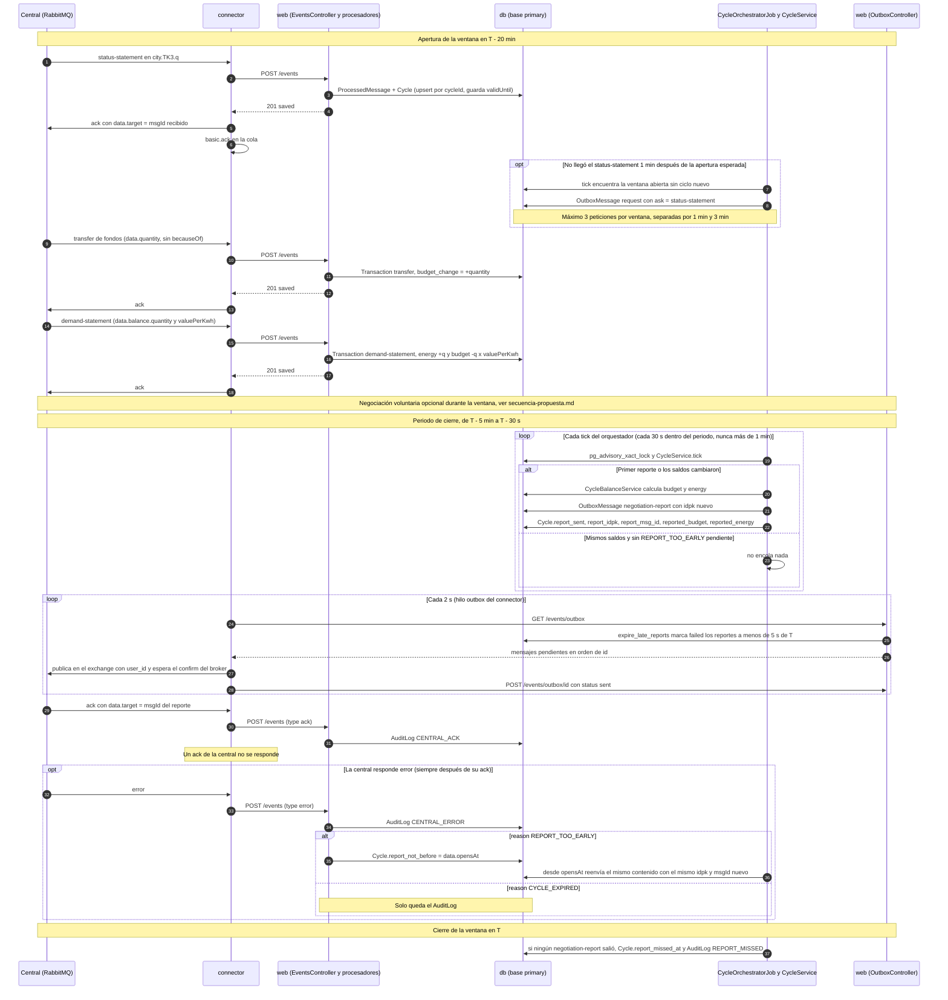

# Secuencia de un ciclo de negociación

Un ciclo completo visto desde nuestro nodo. `T` es el `data.validUntil` del `status-statement`, es decir, el
cierre de la ventana de negociación. El código trabaja siempre relativo a `T` (`app/services/cycle_service.rb:5-22`):
la ventana abre en `T - 20 min`, el periodo de cierre va de `T - 5 min` a `T`, y el reporte solo se encola hasta
`T - 30 s`. Si `T` cae en una hora en punto, eso corresponde a xx:40, xx:55 y xx:59:30.
El detalle de cada entrega al back (validación y ramas por código HTTP) está en `secuencia-evento-entrante.md`, y la
negociación voluntaria en `secuencia-propuesta.md`.

## Referencias en el código

| Paso | Dónde |
|---|---|
| Ventana, periodo de cierre y márgenes | `app/services/cycle_service.rb:5-22` |
| Petición del `status-statement` si no llega | `app/services/cycle_service.rb:79-110` |
| Petición de `distance-table` si la tabla está vacía | `app/services/cycle_service.rb:63` |
| Guardado del `status-statement` | `app/services/status_statement_processor_service.rb` |
| `transfer` y `demand-statement` en el ledger | `app/services/ledger_processor_service.rb:14-24` |
| Cuándo se encola el reporte | `app/services/cycle_service.rb:113-122` |
| Reporte nuevo vs. corrección vs. reintento (mismo `idpk`) | `app/services/cycle_service.rb:124-141` |
| Saldos del reporte | `app/services/cycle_balance_service.rb` |
| Reportes que no alcanzan a salir | `app/models/outbox_message.rb:16-23` |
| Publicación del outbox | `connector/lib/outbox_sender.rb`, `connector/consumer.rb:65-77` |
| `REPORT_TOO_EARLY` | `app/services/error_processor_service.rb:20-22`, `app/services/cycle_service.rb:68-75` |
| Ciclo sin reporte entregado | `app/services/cycle_service.rb:144-164` |

## A confirmar

- Que la central publique en el orden mostrado (`status-statement`, `transfer`, `demand-statement`). El código no
  depende del orden y el enunciado dice que `demand-statement` llega "cada cierto tiempo".
- Que `validUntil` caiga en horas en punto (de eso salen los xx:40, xx:55 y xx:59:30). El código no lo asume.
- Que en producción no se hayan cambiado `CYCLE_LENGTH_MINUTES`, `NEGOTIATION_WINDOW_MINUTES` ni
  `REPORT_PERIOD_MINUTES` (por defecto 120, 20 y 5).
