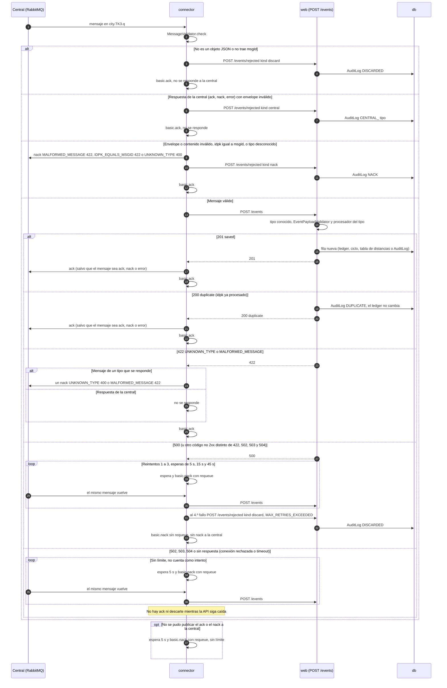

# Secuencia de un mensaje entrante

Qué pasa con cada mensaje que llega a la cola `city.TK3.q`. El connector consume con `prefetch(1)` y ack manual,
lo valida (`MessageValidator`), y si es válido lo entrega con `POST /events`. Según la respuesta del back decide si
responde `ack` o `nack` a la central y qué hace con el mensaje en la cola: `basic.ack` (sale de la cola),
`basic.nack` con requeue (vuelve a la cola) o `basic.nack` sin requeue (descartado). Las respuestas de la central
(`ack`, `nack`, `error`) se guardan pero nunca se responden.

## Referencias en el código

| Paso | Dónde |
|---|---|
| Consumo, `prefetch(1)`, ack manual y `settle` | `connector/consumer.rb:41-50`, `87`, `97-99` |
| Reglas de validación del connector | `connector/lib/message_validator.rb:20-50` |
| Descarte, NACK propio y entrega | `connector/lib/message_processor.rb:44-57`, `107-161` |
| Reintentos 5/15/45 s y descarte | `connector/lib/message_processor.rb:12`, `76-98` |
| Espera sin límite (API caída o no se pudo publicar) | `connector/lib/message_processor.rb:14`, `50-62`; `connector/lib/master_client.rb:21-23` |
| Respuestas del back | `app/controllers/events_controller.rb:34-63` |
| 503 si la base no está disponible | `app/controllers/events_controller.rb:17-22`, `57-59` |
| Registro de rechazos | `app/controllers/events_controller.rb:65-76`, `app/models/audit_log.rb` |

## Notas de lectura

- "Descarte" en la rama 500 es un `basic.nack` sin requeue al broker, no un `nack` del protocolo: a la central no se
  le publica nada (`message_processor.rb:88-98`).
- Con `ENABLE_PUBLISHER` distinto de `true` los `ack` y `nack` no se publican (solo se loguean) y el flujo sigue
  igual.
- El NACK de la rama 422 no pasa por `POST /events/rejected`, así que no queda fila NACK en `audit_logs`
  (`message_processor.rb:154-161`). Los NACK que decide el propio connector sí quedan.
- La cuenta de fallos de la rama 500 vive en memoria del connector (`@failures`, por `msgId`): un reinicio del
  contenedor la reinicia.

## A confirmar

- Si el NACK de la rama 422 debería registrarse en `audit_logs` como los demás (hoy no se registra).
