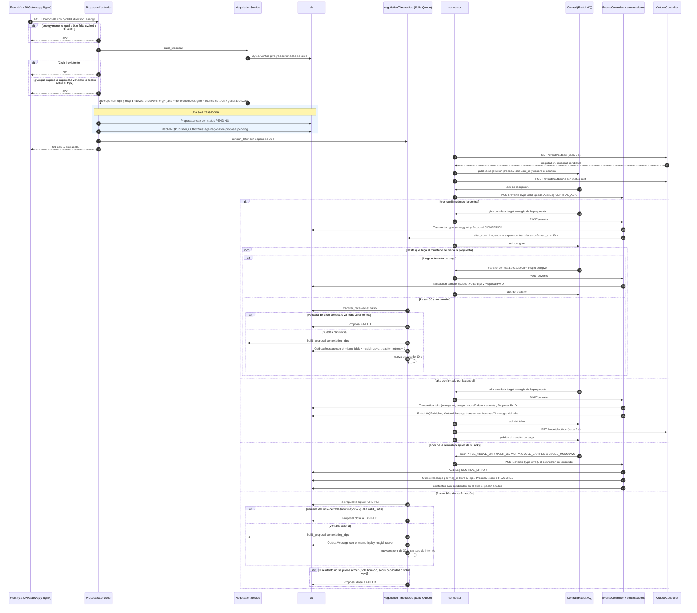

# Secuencia de una propuesta de negociación (give y take)

Flujo de una `negotiation-proposal` creada desde el front: validación local, persistencia de la propuesta y del
mensaje de salida en una sola transacción, publicación por el outbox, confirmación de la central y pago.
Hay dos esperas de 30 s distintas en `NegotiationTimeoutJob`: la de la **confirmación** (propuesta `pending`, se
reintenta cada 30 s con el mismo `idpk` hasta que cierra la ventana del ciclo) y la del **transfer** de un `give`
ya confirmado (hasta 3 reintentos con el mismo `idpk`). Cada reintento lleva un `msgId` nuevo.

## Referencias en el código

| Paso | Dónde |
|---|---|
| Validación de parámetros y respuesta | `app/controllers/proposals_controller.rb:11-69` |
| Precio, tope y capacidad vendible | `app/services/negotiation_service.rb:6-64` |
| Transacción propuesta + outbox | `app/controllers/proposals_controller.rb:37-49` |
| Primera espera de 30 s | `app/controllers/proposals_controller.rb:52` |
| `give` → CONFIRMED | `app/services/ledger_processor_service.rb:51-52`, `78-81` |
| Espera del transfer agendada | `app/models/proposal.rb:27`, `74-77` |
| `transfer` con `becauseOf` → PAID | `app/services/ledger_processor_service.rb:57-60`, `109-117` |
| `take` → PAID y transfer de pago | `app/services/ledger_processor_service.rb:54-55`, `86-105` |
| Error de la central → REJECTED | `app/services/error_processor_service.rb:6`, `23-24`, `32-47`; `app/models/proposal.rb:36-44` |
| Espera de confirmación, EXPIRED y reintento | `app/jobs/negotiation_timeout_job.rb:13-44` |
| Espera del transfer, hasta 3 reintentos | `app/jobs/negotiation_timeout_job.rb:51-94`; `app/models/proposal.rb:4-5` |
| Mismo `idpk`, `msgId` nuevo | `app/services/negotiation_service.rb:67-68` |

## Notas de lectura

- `Proposal.close!` solo cierra desde el estado indicado en `from:` (por defecto `pending`). Un `error` de la
  central sobre el reintento de un `give` ya confirmado no lo pasa a REJECTED: ese caso lo cierra el job como
  FAILED.
- La propuesta se busca por `data.target` → `outbox_messages.msg_id` → `idpk`. Si no aparece, `LedgerProcessorService`
  toma la primera propuesta PENDING o CONFIRMED del mismo ciclo y dirección (`ledger_processor_service.rb:121-135`).

## A confirmar

- El enunciado pide reintentar con el mismo `idpk` si no llega el transfer; no fija un tope. El tope de 3
  (`Proposal::MAX_TRANSFER_RETRIES`) y el reintento sin tope de una propuesta sin confirmación son decisiones del
  equipo: confirmar que es lo que se quiere documentar.
- El front recibe `201` con `status: "pending"` y luego consulta `GET /proposals` para ver el estado. No se revisó
  cada cuánto refresca.
